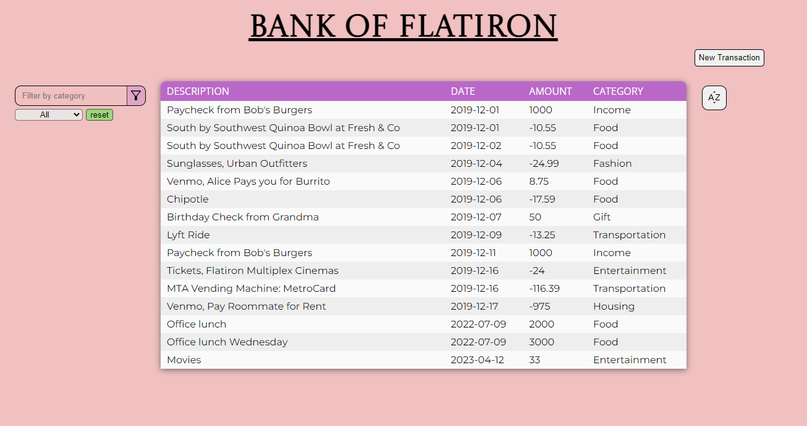

# BANK OF FLATIRON

A simple react app for tracking the transactions of a user's finances

## Table of Contents

1. [Getting started](#Getting-started)
2. [Usage](#Usage)
3. [Code](#Code)
   - [Filter](#filter)
   - [Sort](#sort)
   - [New Transactions](#newT)
4. [Sources](#Sources)

## <a id="Getting-started">Getting started</a>

**Clone** the project files to your local repository:

- HTTPS => `https://github.com/edd-ie/Bank-of-Flatiron..git`
- SSH => `git@github.com:edd-ie/Bank-of-Flatiron..git`
- Git CLI => `gh repo clone edd-ie/Bank-of-Flatiron..git`

Install all dependencies using.

```
npm install
```

Open your terminal and run this command to start json-server.

```
npm run server
```

Open a new terminal and run this command to start the react app (accept the assigning of a new port)

```
npm start
```

Your default browser will be launched and the application will be rendered.


## <a id="Usage">Usage</a>

The application displays the list of transaction the user has done in a timeframe.

<link rel="stylesheet"
    href="https://fonts.googleapis.com/css2?family=Material+Symbols+Outlined:opsz,wght,FILL,GRAD@48,400,0,0" />
User can sort the data by categories by clicking the sort button
<span class="material-symbols-outlined">
    sort_by_alpha
</span>
<br></br>

User can filter data by categories by choicing from the list or typing on the category and clicking the filter button.
<span class="material-symbols-outlined">
filter_alt
</span>

Users can also add to the table by click the new transaction button, which generates a form fill in the details.
<button>new transactions</button>

## <a id="Code">Code</a>

The JavaScript code for the Mercury website is included in the index.js file. The file contains various functions: `crypto()`, `stocks()`, `commodities()`, `indictators()`.

### <a id="filter">Filter</a>

Data filtering & grouping is handle by `Tables.js`

### <a id="sort">Sort</a>

Data sorting is handle by `Tables.js`

### <a id="newT">New transaction</a>

New transactions are handle by `Form.js`

## <a id="Sources">Sources</a>

The application uses icons and fonts from the following sources

- Fonts source - [Google Fonts](https://fonts.googleapis.com/css2?family=Poppins:wght@300;400;500;600;700&display=swap)
- Icons source - [Google Icons](https://fonts.googleapis.com/css2?family=Material+Symbols+Outlined:opsz,wght,FILL,GRAD@48,400,1,0)
